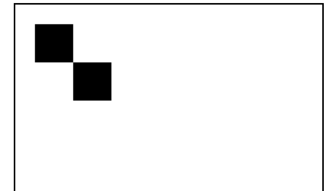

# Painting Board made with Vailla JS

## canvas란?

## js로 정사각형 그리기

js로 html의 element`canvas`를 변수선언을 해줍니다. 기본적인 canvas가 완성되었고 우리는 그 틀에서 사용할 js의 기본적인 붓(브러쉬)인 `context`를 변수로 선언해줍니다.

- canvas
- context(ctx)
  - Rect :라인을 만드는 것(fill/stroke를 따로 설정해주지않으면 브라우저에 나타나지 않는다.)
  - fill :단색으로 모양을 채우는 것
  - stroke :선만 보이는것
  - fillRect :단축함수(Rect/fill을 합친 것)
  - strokeRect :단축함수(Rect/stroke을 합친 것)
- beginPath: 새로운 (path)경로룰 먼들어 주는 것

  **_Rect는 4가지 인수를 갖는다. x,y,w,h (x,y)canvas안에 위치할 좌표와 (w,h)라인르 갖게 될 너비와 높이의 설정값_**

-`context(ctx)`: 기본적인 붓(브러쉬)입니다.컨버스에 그림을 그릴때 사용합니다. context에는 두가지 옵션이 있고, 2d말고 다른 옵션은 3d를 위한 설정입니다.

```js
const canvas = document.querySelector("canvas");
const ctx = canvas.getContext("2d");
```

### Rect에 대해 알아보기

1 예제

```js
//    x   y   w    h
ctx.rect(50, 50, 100, 100);
ctx.rect(150, 150, 100, 100);
ctx.fill();
ctx.rect(250, 250, 100, 100);
```

결과

rect로 라인을 만들어주고 fill/stroke를 선택해주어야한다.
`ctx.fill`선택 후 다음으로 만들어둔 라인은 보이지 않는다.

2 예제

```js
ctx.rect(50, 50, 100, 100);
ctx.rect(150, 150, 100, 100);
ctx.fill();
ctx.rect(250, 250, 100, 100);
ctx.rect(350, 350, 100, 100);
ctx.fillStyle = "red";
ctx.fill();
```

결과

`fillStyle`로 css와 같은 기능을 할수있다. 색상설정후 `ctx.fill`을 채워주면 모두 같은 색상을 가지게 된다. 이것으로 알수있는것은 이 모든 rect는 같은 경로를 가지고 있다는 것을 알수있다.

3 예제

```js
ctx.rect(50, 50, 100, 100);
ctx.rect(150, 150, 100, 100);
ctx.rect(250, 250, 100, 100);
ctx.fill();

ctx.beginPath();
ctx.rect(350, 350, 100, 100);
ctx.rect(450, 450, 100, 100);
ctx.fillStyle = "red";
ctx.fill();
```

결과

앞에 예제 1,2는 같은 경로안에 라인으로 된 상자를 그려주었다.
만약 다른 컬러의 상자를 만들고싶다면 `beginPath`로 경로를 나눠주면 된다. 

너너너